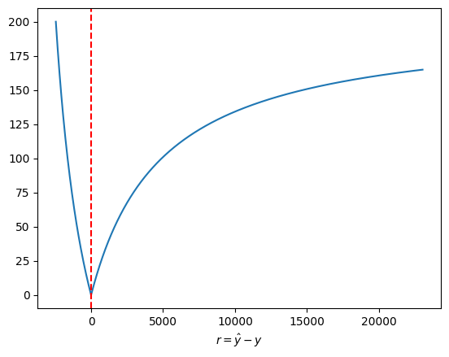

# dacon_elec
## Submissions
| No |         Date         | CV SMAPE (mean/std) |    Test SMAPE    | Features                                                                                                                             |
|----|:--------------------:|:-------------------:|:----------------:|--------------------------------------------------------------------------------------------------------------------------------------|
| 1  | 2023-08-14 00:07:06  | 7.319213 / 0.027626 |   7.3584366253   | ['temp', 'pcpn', 'wn_spd', 'hmd', 'area', 'c_area', 'm', 'h', 'di', 'gbmht', 'hd']                                                   |
| 2  | 2023-08-14 14:58:54  |    7.295225 / -     |   7.3430932744   | ['temp', 'pcpn', 'wn_spd', 'hmd', 'area', 'c_area', 'm', 'sinh', 'cosh', 'di', 'gbmht', 'hd']                                        |
| 3  | 2023-08-15 21:50:38  | 6.459990 / 0.027497 |   7.5985445132   | ['temp', 'pcpn', 'wn_spd', 'hmd', 'm', 'h', 'di', 'gbmwdht', 'hd']                                                                   |
| 4  | 2023-08-16 22:07:38  | 6.874945 / 0.026166 |   7.090952714    | ['temp', 'pcpn', 'wn_spd', 'hmd', 'm', 'h', 'di', 'gbmt', 'gbwt', 'gbwdt', 'gbht', 'hd']                                             |
| 5  | 2023-08-17 23:22:46  | 7.721417 / 0.026394 |   7.2037221875   | ['temp', 'pcpn', 'wn_spd', 'hmd', 'di', 'gbmt', 'gbwt', 'gbwdt', 'gbht', 'gbhdt', 'gbmont', 'gbsunt', 'hd']                          |
| 6  | 2023-08-19 01:09:45  | 6.523173 / 0.026867 |   6.8626078093   | ['temp', 'pcpn', 'wn_spd', 'hmd', 'di', 'gbmht', 'gbwht', 'gbwdht', 'gbht', 'gbhdht', 'gbmonht', 'gbsunht']                          |
| 7  | 2023-08-19 23:31:59  | 8.565082 / 0.033996 |   7.3973001845   | ['temp', 'pcpn', 'wn_spd', 'hmd', 'di', 'gbmht', 'gbwht', 'gbwdht', 'gbht', 'gbhdht', 'gbmonht', 'gbsunht']                          |
| 8  | 2023-08-20 13:17:02  | 8.63984 / 0.287639  |   5.8889348417   | ['temp', 'pcpn', 'wn_spd', 'hmd', 'di', 'sinh', 'cosh', 'thirty' 'gbmht', 'gbwht', 'gbwdht', 'gbht', 'gbhdht', 'gbmonht', 'gbsunht'] |
| 9  | 2023-08-21 00:03:47	 | 8.441246 / 0.277251 |   5.7940004726   | ['temp', 'pcpn', 'wn_spd', 'hmd', 'di', 'sinh', 'cosh', 'thirty' 'gbmht', 'gbwht', 'gbwdht', 'gbht', 'gbhdht', 'gbmonht', 'gbsunht'] |
| 10 | 2023-08-22 09:18:54	 | 7.811795 / 3.848800 |   6.4326651592   | ['temp', 'pcpn', 'wn_spd', 'hmd', 'di', 'sinh', 'cosh', 'thirty' 'gbmht', 'gbwht', 'gbwdht', 'gbht', 'gbhdht', 'gbmonht', 'gbsunht'] |
| 11 | 2023-08-22 10:32:17	 | 8.387001 / 0.279191 |   5.7623766675   | ['temp', 'pcpn', 'wn_spd', 'hmd', 'di', 'sinh', 'cosh', 'thirty' 'gbmht', 'gbwht', 'gbwdht', 'gbht', 'gbhdht', 'gbmonht', 'gbsunht'] |
| 12 | 2023-08-22 21:34:02	 | 8.390656 / 0.279009 |   5.7697087696   | ['temp', 'pcpn', 'wn_spd', 'hmd', 'di', 'sinh', 'cosh', 'thirty' 'gbmht', 'gbwht', 'gbwdht', 'gbht', 'gbhdht', 'gbmonht', 'gbsunht'] |
| 13 | 2023-08-23 23:26:17	 | 6.883666 / 0.195356 |   5.7781272617   | ['temp', 'pcpn', 'wn_spd', 'hmd', 'm', 'wd', 'h', 'sinh', 'cosh', 'w', 'di', 'hd', 'mon', 'sun', 'thirty']                           |
| 14 | 2023-08-24 00:45:15	 | 7.541097 / 0.213188 | **5.7609990288** | ['temp', 'pcpn', 'wn_spd', 'hmd', 'm', 'wd', 'h', 'sinh', 'cosh', 'w', 'di', 'hd', 'mon', 'sun', 'thirty', 'gbht']                   |

## Memo
- 6th submission 이전까지는 학습 과정에 있어 테스트 데이터가 활용되었기 때문에 CV SMAPE의 신뢰도가 떨어진다.
- 8th submission부터 objective function 변경
- 9th submission부터 백화점 휴일 데이터 제거
- 10th submission에 grid search를 적용하였지만 성능이 좋지 않았다.
- 11th submission에서 subsample과 colsample_bytree 값으로 각각 0.8 사용
- 12th submission에서 objective function 계수 조정
- 14th submission부터 신뢰 가능

## SMAPE
$$\text{SMAPE}=\dfrac{100}{n}\sum_{i=1}^n\dfrac{\vert \hat{y}_i-y_i \vert}{(\vert y_i \vert+\vert \hat{y}_i \vert)/2}$$
```python
import numpy as np
import matplotlib.pyplot as plt

def draw_sape(y_pred, y_true):
    sape = 100 * np.abs(y_pred - y_true) / ((np.abs(y_true) + np.abs(y_pred)) / 2)
    fig, ax = plt.subplots()
    ax.plot(y_pred - y_true, sape)
    ax.axvline(x=0, c='r', linestyle='--')
    ax.set_xlabel('$r=\hat{y}-y$')
    plt.show()

draw_sape(np.linspace(data.train['target'].min(), data.train['target'].max(), 1000), data.train['target'].mean())
```


## References
- [SMAPE](https://en.wikipedia.org/wiki/Symmetric_mean_absolute_percentage_error)
- [Discomfort Index](https://news.samsungdisplay.com/32491)
- [XGBoost - Custom Objective & Evaluation Metric](https://xgboost.readthedocs.io/en/stable/tutorials/custom_metric_obj.html)
- [XGBoost - fpreproc](https://xgboost.readthedocs.io/en/stable/python/examples/cross_validation.html)
- [sklearn - TimeSeriesSplit](https://scikit-learn.org/stable/modules/generated/sklearn.model_selection.TimeSeriesSplit.html)
- [Pandas - Moving Average](https://pandas.pydata.org/docs/reference/api/pandas.DataFrame.rolling.html)
